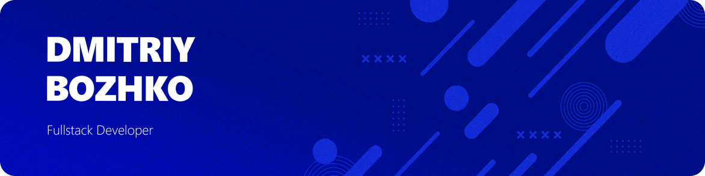

## **I'm a Mobile Developer**

Hi! I specialize in developing mobile applications using Flutter, with a strong focus on creating intuitive and visually appealing user interfaces. Before diving into mobile development, I actively worked on building websites with Nuxt.js, which provided me with a solid background in web development. I emphasize clean, readable, and maintainable code, considering it one of the core values of my work. I am also passionate about optimizing the development process by creating and improving project templates with ready-to-use structures and features.

#

🔷 Main focus: Flutter

🔷 Core stack for mobile development: GetX, Dio, Firebase

🔷 Secondary focus: Web development with Nuxt.js

🔷 Strong emphasis on clean, readable, and maintainable code

🔷 Constantly exploring ways to speed up development: creating and improving project templates to make the process more efficient

🔷 I love designing interfaces that make applications and websites user-friendly and memorable
