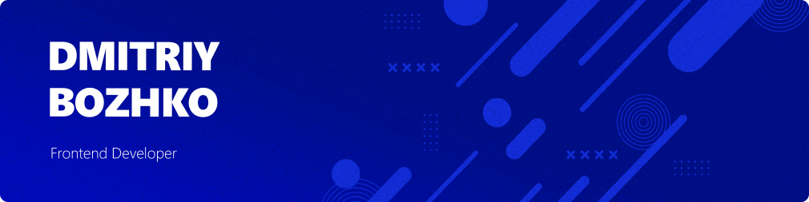

## **I'm a Mobile Developer**

Hi! I develop web and mobile apps, with a focus on creating amazing user interfaces. My main areas are frontend for web applications on Nuxt.js and mobile applications on React Native. My arsenal also includes React, Next.js, Vue.js and Laravel. With over 2 years of experience, I am involved in creating interactive websites and applications that inspire users. I am constantly studying the latest technologies and trends in web development in order to provide the most advanced solutions and the best user experience.
#

**`Flutter`** 

#

🔷 My main directions: Nuxt.js, React Native

🔷 Stack for fullstack web applications: NuxtJS/Laravel, NextJS/NestJS

🔷 I have **more than 2 years** of experience

🔷 I always prefer to use TypeScript and SCSS in my projects

🔷 When developing on NuxtJS, I always prefer to use the Composition API style

🔷 I like to write clean and easy-to-read code. This is my passion and one of the most important aspects of my approach

#

[//]: # ()

[//]: # ()

[//]: # ()

[//]: # ()

[//]: # ()